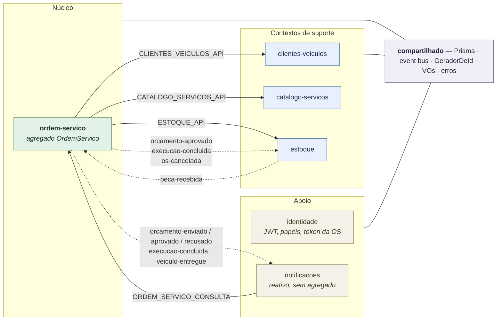
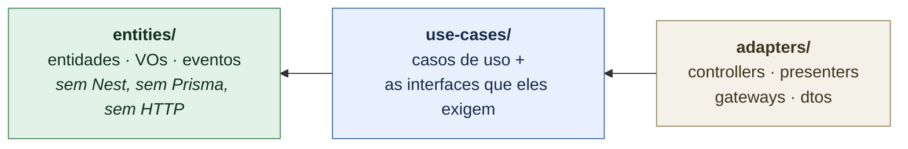
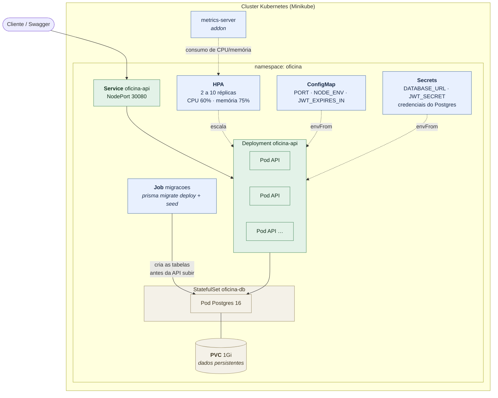
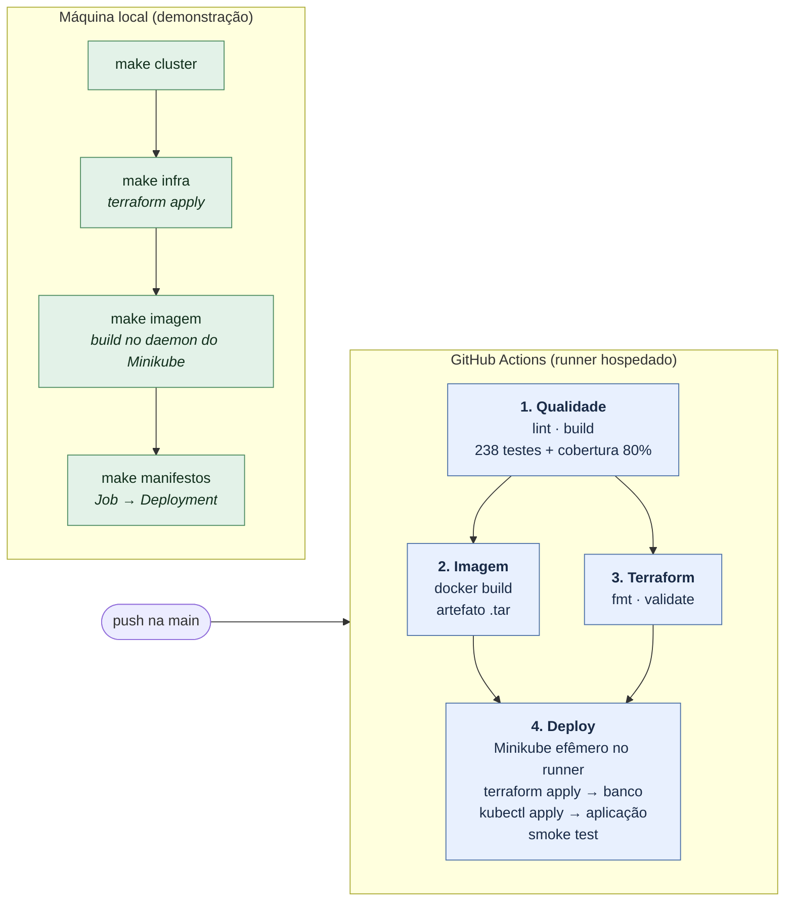
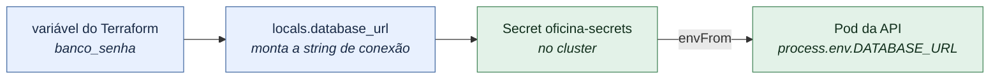

# Sistema de Oficina — Back-end

Back-end do Sistema de Atendimento e Execução de Serviços de uma oficina mecânica:
cadastro de clientes/veículos, **Ordem de Serviço** (diagnóstico → orçamento → execução →
entrega), controle de **estoque de peças** e acompanhamento do cliente por link público.

**Stack:** TypeScript · NestJS 11 · PostgreSQL 16 + Prisma 5 · JWT · Swagger.
**Infraestrutura:** Docker · Kubernetes (Minikube) · Terraform · GitHub Actions.

---

## Entregáveis da Fase 2

| Item | Onde |
|---|---|
| Descrição da solução e objetivos desta fase | [Objetivos](#objetivos) |
| Desenho da arquitetura — componentes da aplicação | [Arquitetura](#arquitetura) |
| Desenho da arquitetura — infraestrutura provisionada | [Componentes](#componentes) |
| Desenho da arquitetura — fluxo de deploy | [Fluxo de deploy](#fluxo-de-deploy) |
| Instruções de execução local | [Rodando localmente](#rodando-localmente) |
| Instruções de deploy em Kubernetes | [Deploy no Kubernetes](#deploy-no-kubernetes) |
| Instruções de provisionamento com Terraform | [Provisionamento com Terraform](#provisionamento-com-terraform) |
| Collection completa das APIs | [Collection das APIs](#collection-das-apis) |
| Vídeo demonstrativo | [Vídeo demonstrativo](#vídeo-demonstrativo) |

---

## Objetivos

Digitalizar o atendimento de uma oficina mecânica, do recebimento do veículo à entrega,
concentrando as regras de negócio no agregado **Ordem de Serviço**:

- **Cadastros:** clientes, veículos, serviços e peças (com saldo de estoque).
- **Ordem de Serviço ponta a ponta:** recebimento → diagnóstico → orçamento → aprovação do
  cliente → execução → finalização → pagamento → entrega, com uma **máquina de estados** que
  rejeita transições inválidas (HTTP 422).
- **Orçamento com preço congelado** (snapshot no diagnóstico) e **vários orçamentos por OS**: um
  inicial e adicionais para reparos descobertos durante a execução.
- **Estoque e cotação:** peça disponível é reservada na aprovação; peça em falta é **encomendada**,
  a OS fica em *Aguardando peça* e **retoma a execução automaticamente** quando a peça dá entrada.
- **Fila de trabalho** (`GET /ordens-servico/fila`): OS ativas ordenadas por prioridade de status,
  mais antigas primeiro, sem as finalizadas/entregues.
- **Acompanhamento do cliente** por link público (token da OS): consultar o status e aprovar/recusar
  orçamentos sem login de operador.
- **Notificações** ao cliente disparadas por evento (ex.: orçamento enviado).

Na **Fase 2**, a mesma aplicação ganha a infraestrutura que a sustenta em escala:

- **Clean Architecture** em todos os módulos, com a regra de dependência apontando para dentro.
- **Containerização** revisada: imagem multi-stage, usuário sem privilégios, migrations fora do start.
- **Orquestração em Kubernetes**: Deployment, Service, ConfigMap, Secrets, Job e **HPA**
  (escala automática por CPU/memória).
- **Infraestrutura como código** com Terraform: namespace, segredos e banco de dados provisionados
  por comando, não à mão.
- **CI/CD** no GitHub Actions: build, testes, imagem Docker e deploy verificado num cluster real.

---

## Rodando localmente

O ambiente completo — API e Postgres — sobe com **um comando**. Não é preciso Node,
Postgres nem nada além do Docker na máquina.

### Pré-requisitos

| | |
|---|---|
| **Obrigatório** | Docker Engine com o plugin `docker compose` (v2) |
| Opcional | `jq`, só para deixar legíveis os exemplos de `curl` deste README |

Confirme antes de começar:

```bash
docker --version           # Docker version 28.x
docker compose version     # Docker Compose version v2.x
```

### Passo 1 — Clonar o repositório

```bash
git clone git@github.com:madurubini/workshop-manager.git
cd workshop-manager
```

### Passo 2 — Subir o ambiente

```bash
docker compose up --build          # em segundo plano: docker compose up --build -d
```

O primeiro build leva alguns minutos (instala dependências e compila). Nas vezes seguintes o
Docker reaproveita o cache e sobe em segundos.

Três coisas acontecem no start, nesta ordem (script `docker-entrypoint.sh`):

1. **`prisma migrate deploy`** — cria as tabelas a partir de `prisma/migrations/`;
2. **`node dist/prisma/seed.js`** — popula usuário, serviços e peças de exemplo. É idempotente:
   pode subir quantas vezes quiser sem duplicar nada;
3. **`node dist/main`** — sobe a API.

Está pronto quando aparecer no log:

```
Nest application successfully started
API ouvindo em http://localhost:3000/api/v1
Swagger em http://localhost:3000/api/docs
```

### Passo 3 — Conferir que está no ar

```bash
docker compose ps
# oficina-app e oficina-db devem estar "Up" e "(healthy)"

curl http://localhost:3000/api/v1/health
# {"status":"ok","info":{"database":{"status":"up"}}, ...}
```

`"database":"up"` é a prova de que a API alcançou o Postgres.

### Passo 4 — Fazer login

O seed criou um usuário administrativo:

```bash
curl -s -X POST http://localhost:3000/api/v1/auth/login \
  -H 'Content-Type: application/json' \
  -d '{ "username": "gestor", "senha": "gestor123" }'
# { "accessToken": "eyJhbGciOi...", "expiresIn": 3600 }
```

Guarde o token para as chamadas autenticadas:

```bash
TOKEN=$(curl -s -X POST http://localhost:3000/api/v1/auth/login \
  -H 'Content-Type: application/json' \
  -d '{ "username": "gestor", "senha": "gestor123" }' | jq -r .accessToken)
```

Daqui, siga para o [Passeio de 2 minutos](#passeio-de-2-minutos-fluxo-completo-via-curl),
que percorre uma OS do recebimento à entrega — ou abra o Swagger e explore pela interface.

### Onde fica cada coisa

| Recurso | Endereço |
|---|---|
| API | http://localhost:3000/api/v1 |
| Swagger | http://localhost:3000/api/docs |
| OpenAPI JSON | http://localhost:3000/api/docs-json |
| Health check | http://localhost:3000/api/v1/health |
| Postgres (no host) | `localhost:5433` — usuário `oficina`, senha `oficina`, banco `oficina` |

> A porta **5433** é usada de propósito no host, porque a 5432 costuma estar ocupada por outro
> Postgres. Dentro da rede do compose a API fala com o banco em `db:5432`.

### Comandos do dia a dia

```bash
docker compose logs -f app     # acompanhar os logs da API
docker compose ps              # estado dos containers e health
docker compose restart app     # reiniciar só a API
docker compose down            # parar tudo, mantendo os dados no volume
docker compose down -v         # parar e APAGAR o banco (volume oficina-pgdata)
```

Para recomeçar do zero, com o banco limpo:

```bash
docker compose down -v && docker compose up --build
```

### Configuração

Os valores usados pelo compose têm padrões de desenvolvimento e podem ser sobrescritos por um
arquivo `.env` na raiz — use o [`.env.example`](.env.example) como base:

```bash
cp .env.example .env
```

| Variável | Padrão | Para quê |
|---|---|---|
| `POSTGRES_USER` / `POSTGRES_PASSWORD` / `POSTGRES_DB` | `oficina` | Credenciais do Postgres |
| `POSTGRES_PORT` | `5433` | Porta do banco no host |
| `APP_PORT` | `3000` | Porta da API no host |
| `JWT_SECRET` | segredo de desenvolvimento | Assinatura dos tokens |
| `JWT_EXPIRES_IN` | `3600s` | Validade do token |

---

## Autenticação

O seed cria um usuário administrativo e dados de exemplo (2 serviços e 2 peças — uma com saldo e
uma em falta, para exercitar a cotação/encomenda):

| username | senha       | papel  |
|----------|-------------|--------|
| `gestor` | `gestor123` | GESTOR |

```bash
TOKEN=$(curl -s -X POST http://localhost:3000/api/v1/auth/login \
  -H 'Content-Type: application/json' \
  -d '{ "username": "gestor", "senha": "gestor123" }' | jq -r .accessToken)
```

Use o token nas rotas administrativas: `Authorization: Bearer $TOKEN`. Novos usuários são criados
por um GESTOR via `POST /usuarios` (`{ username, senha, papel }`).

No Swagger, clique em **Authorize** e cole o `accessToken` para testar as rotas pelo navegador.

---

## Passeio de 2 minutos (fluxo completo via curl)

Com a API no ar e o `$TOKEN` do passo anterior (os exemplos usam `jq` para ler o JSON). Os ids de
serviço e peça vêm do seed. **Documento e placa são únicos** — se repetir a execução, troque os
valores ou recrie o banco (`docker compose down -v`), senão vem `409 CONFLITO`.

```bash
API=http://localhost:3000/api/v1
AUTH="Authorization: Bearer $TOKEN"
JSON="Content-Type: application/json"

# 1. Cliente e veículo
CLIENTE=$(curl -s -X POST $API/clientes -H "$AUTH" -H "$JSON" \
  -d '{ "documento": "11144477735", "nome": "Ana Souza" }' | jq -r .id)

VEICULO=$(curl -s -X POST $API/clientes/$CLIENTE/veiculos -H "$AUTH" -H "$JSON" \
  -d '{ "placa": "RTY7H21", "marca": "Ford", "modelo": "Ka", "ano": 2020 }' | jq -r .id)

# 2. Abrir a OS → "Recebida"
OS=$(curl -s -X POST $API/ordens-servico -H "$AUTH" -H "$JSON" \
  -d "{ \"clienteId\": \"$CLIENTE\", \"veiculoId\": \"$VEICULO\",
        \"problemaRelatado\": \"Barulho na suspensão\" }" | jq -r .id)

# 3. Iniciar o diagnóstico → "Em diagnóstico"
curl -s -X POST $API/ordens-servico/$OS/diagnostico/iniciar -H "$AUTH" | jq -r .status

# 4. Registrar itens e concluir o diagnóstico → orçamento gerado E enviado ao cliente
#    (11111111… = "Troca de óleo" R$ 120; 33333333… = "Filtro de óleo" R$ 35 — ambos do seed)
#    → status "Aguardando aprovação", total 190
ORCAMENTO=$(curl -s -X POST $API/ordens-servico/$OS/diagnostico -H "$AUTH" -H "$JSON" \
  -d '{ "servicos": [{ "servicoId": "11111111-1111-4111-8111-111111111111", "quantidade": 1 }],
        "pecas":    [{ "pecaId":    "33333333-3333-4333-8333-333333333333", "quantidade": 2 }] }' \
  | jq -r .orcamento.id)

# 5. Consulta pública do cliente (só o id da OS, sem login)
curl -s $API/acompanhamento/$OS | jq '{ status, total: .orcamentos[0].total }'

# 6. Cliente aprova o orçamento → "Em execução" (e o estoque reserva as peças)
#    Aprovar exige o TOKEN DA OS, que vai no link enviado ao cliente. No MVP o notificador
#    registra esse link no log da aplicação, então dá para pescá-lo de lá:
TOKEN_OS=$(docker compose logs app --since 5m | grep -o 'token=[A-Za-z0-9._-]*' | tail -1 | cut -d= -f2)

curl -s -X POST $API/acompanhamento/$OS/orcamentos/$ORCAMENTO/resposta \
  -H "Authorization: Bearer $TOKEN_OS" -H "$JSON" -d '{ "aprovado": true }' | jq -r .status

# 7. Fila de trabalho (a OS aparece nela enquanto está ativa) e reserva no estoque
curl -s $API/ordens-servico/fila -H "$AUTH" | jq -c '.[] | { numero, status }'
curl -s $API/pecas/33333333-3333-4333-8333-333333333333 -H "$AUTH" | jq -c '{ saldoFisico, reservado }'
# → num banco recém-semeado: {"saldoFisico":10,"reservado":2} — a baixa só acontece na conclusão

# 8. Concluir a execução, pagar e entregar
curl -s -X POST $API/ordens-servico/$OS/execucao/concluir -H "$AUTH" | jq -r .status   # Finalizada
curl -s -X POST $API/ordens-servico/$OS/pagamento -H "$AUTH" -H "$JSON" -d '{ "pago": true }' | jq -r .pago
curl -s -X POST $API/ordens-servico/$OS/entrega -H "$AUTH" | jq -r .status              # Entregue
```

> Sem o `Authorization` do passo 6 a resposta é `401 NAO_AUTENTICADO` ("Token de acompanhamento
> ausente") — a consulta é pública, mas **aprovar/recusar não é**.
>
> Para ver o desvio de **peça em falta**, refaça o passo 4 usando a peça `44444444-4444-4444-8444-444444444444`
> (saldo zero no seed): a aprovação leva a OS para *Aguardando peça*, e um
> `PATCH /pecas/{id}/estoque` com `{ "tipo": "ENTRADA", "quantidade": 1 }` a devolve para *Em execução*.

---

## Endpoints principais

Base `/api/v1`. A referência completa (schemas e exemplos) está no **Swagger** em `/api/docs`;
o contrato comentado, em [`docs/contrato-api.md`](docs/contrato-api.md).

- **Auth:** `POST /auth/login` · **Usuários (GESTOR):** `POST /usuarios`
- **CRUD (JWT):** `/clientes`, `/clientes/{id}/veiculos`, `/veiculos/{id}`, `/servicos`, `/pecas`,
  `PATCH /pecas/{id}/estoque`
- **Ordem de Serviço (JWT):** `POST /ordens-servico`, `GET /ordens-servico[/{id}]`,
  `GET /ordens-servico/fila`, `POST .../diagnostico/iniciar`, `POST .../diagnostico`,
  `POST .../execucao/concluir`, `POST .../orcamentos-adicionais`, `POST .../pagamento`,
  `POST .../entrega`, `GET /relatorios/tempo-medio-execucao`
- **Acompanhamento (público, token da OS):** `GET /acompanhamento/{osId}`,
  `POST .../orcamentos/{orcamentoId}/resposta`
- **Infra (público):** `GET /health`

**Padrão de erro:**

```json
{ "erro": { "codigo": "NAO_AUTENTICADO", "mensagem": "Credenciais inválidas.", "detalhes": null } }
```

Status: 400 (validação), 401/403 (auth), 404, 409 (conflito), 422 (transição de status inválida).
Todo erro sai nesse envelope — inclusive os que nascem no validador ou no banco —, e um 500 traz
`detalhes.idDaOcorrencia`, o mesmo id registrado no log. A tabela completa de códigos está em
[`docs/contrato-api.md`](docs/contrato-api.md#erros).

---

## Fluxo de uso (jornada da OS)

Sequência típica via API. As rotas administrativas exigem `Authorization: Bearer <accessToken>`;
as de `/acompanhamento` usam o **token da OS** (devolvido na notificação ao cliente).

1. **Abrir a OS** — `POST /ordens-servico` `{ clienteId, veiculoId, problemaRelatado }` → *Recebida*.
2. **Iniciar o diagnóstico** — `POST /ordens-servico/{id}/diagnostico/iniciar` → *Em diagnóstico*
   (o mecânico assume a OS antes de lançar itens).
3. **Concluir o diagnóstico** — `POST /ordens-servico/{id}/diagnostico` `{ servicos, pecas }`:
   gera o orçamento, verifica o estoque (cota as peças em falta), **envia ao cliente** e notifica →
   *Aguardando aprovação*.
4. **Cliente responde** — `POST /acompanhamento/{osId}/orcamentos/{orcamentoId}/resposta`
   `{ aprovado }`. Aprovado → *Em execução* (ou *Aguardando peça*, se algo foi encomendado);
   recusado → *Cancelada*.
5. **Peça encomendada chega** — `PATCH /pecas/{id}/estoque` `{ tipo: "ENTRADA", quantidade }`:
   a OS sai de *Aguardando peça* e **retoma para *Em execução* automaticamente** (registrada como
   ação do "sistema" no histórico).
6. **Concluir a execução** — `POST /ordens-servico/{id}/execucao/concluir` → *Finalizada*
   (bloqueia se houver orçamento pendente ou peça por chegar).
7. **Pagamento e entrega** — `POST /ordens-servico/{id}/pagamento` `{ pago: true }`, depois
   `POST /ordens-servico/{id}/entrega` → *Entregue* (a entrega exige pagamento confirmado).

> Reparos descobertos durante a execução viram **orçamento adicional**
> (`POST /ordens-servico/{id}/orcamentos-adicionais`), aprovado pelo cliente no mesmo endpoint de
> acompanhamento; a OS só finaliza quando nenhum orçamento está pendente.

---

## Testes

Rodar a suíte exige **Node 20+** na máquina (o `package.json` pede `engines.node >= 20`).

```bash
npm test          # unitários (entities + use-cases) — sem banco, sem HTTP
npm run test:cov  # com cobertura (threshold GLOBAL de 80%)
npm run test:e2e  # end-to-end (auth, health e fluxo completo da OS via HTTP)
```

Os testes de domínio mockam portas e repositórios, então rodam sem infraestrutura. Já o `test:e2e`
sobe o `AppModule` inteiro contra um **Postgres real**, em um banco dedicado (`oficina_e2e`) que ele
reseta a cada execução — o banco principal nunca é tocado. Prepare-o uma vez:

```bash
docker compose up -d db
docker exec oficina-db psql -U oficina -d oficina -c "CREATE DATABASE oficina_e2e"
npm run test:e2e
```

Para apontar o e2e a outro banco, exporte `DATABASE_URL_E2E` — é assim que a pipeline faz: o job
de qualidade sobe um Postgres como *service container* do GitHub Actions e aponta essa variável
para ele.

---

## Arquitetura

Monolito modular em **DDD** (NestJS + Prisma): um deploy, um banco, organizado por **contexto
delimitado** em `src/`. Módulos nunca importam a entidade ou o repositório um do outro — conversam
por **porta pública** (linha cheia: resposta síncrona) ou por **evento** (linha tracejada: efeito
posterior).



É assim que aprovar um orçamento faz o estoque reservar as peças **e** as notificações avisarem o
cliente, sem que um módulo conheça o outro.

Dentro de cada módulo, **Clean Architecture** em três camadas, com a regra de dependência apontando
para dentro (a quarta — Frameworks & Drivers — é global: `main.ts` e `compartilhado/infraestrutura`):



O ciclo de vida da OS, o fluxo ponta a ponta e o desvio de peça em falta estão desenhados em
**[`docs/arquitetura.md`](docs/arquitetura.md)**.

---

## Infraestrutura (Fase 2)

A Fase 2 evolui a aplicação para rodar em **infraestrutura escalável e provisionada por código**:
containerização revisada, orquestração em Kubernetes, IaC com Terraform e pipeline de CI/CD.
Tudo roda **localmente**, num cluster Minikube.

### Componentes



### Quem provisiona o quê

| | Ferramenta | Recursos |
|---|---|---|
| **Plataforma** | Terraform (`infra/`) | Namespace, Secrets, StatefulSet do Postgres + volume, Service do banco |
| **Aplicação** | Manifestos YAML (`k8s/`) | Deployment, Service, ConfigMap, HPA, Job de migrations |

O que tem **estado ou segredo** fica no Terraform (ele guarda o estado e injeta credenciais por
variável, sem versioná-las); o que é **descartável e recriável** fica em YAML puro, mais direto de
ler e aplicar. Detalhes de cada recurso em [`infra/README.md`](infra/README.md).

### Fluxo de deploy



A pipeline não alcança o cluster da máquina local — um runner hospedado não tem rota até ele. Por
isso o job de deploy **sobe seu próprio Minikube dentro do runner**: o deploy é real e verificado a
cada push (migrations, rollout e smoke test com login), sem depender de nenhuma máquina ligada.

### Pré-requisitos

```bash
# kubectl
curl -LO "https://dl.k8s.io/release/$(curl -Ls https://dl.k8s.io/release/stable.txt)/bin/linux/amd64/kubectl"
install -m 0755 kubectl ~/.local/bin/kubectl && rm kubectl

# minikube
curl -LO https://storage.googleapis.com/minikube/releases/latest/minikube-linux-amd64
install -m 0755 minikube-linux-amd64 ~/.local/bin/minikube && rm minikube-linux-amd64

# terraform
curl -LO https://releases.hashicorp.com/terraform/1.15.9/terraform_1.15.9_linux_amd64.zip
unzip terraform_1.15.9_linux_amd64.zip && install -m 0755 terraform ~/.local/bin/terraform
```

Docker também é necessário — é o "motor" onde o Minikube cria o nó do cluster.

### Deploy no Kubernetes

Com o Makefile, três comandos:

```bash
make cluster      # minikube start + addon metrics-server
make deploy       # terraform apply → build da imagem → manifestos → rollout
make url          # imprime a URL da API e do Swagger
```

Passo a passo, com o que verificar em cada etapa:

**1. Cluster.** O `metrics-server` é quem mede CPU e memória dos pods — sem ele o HPA
não tem como decidir se deve escalar.

```bash
minikube start --driver=docker --cpus=4 --memory=6144
minikube addons enable metrics-server

kubectl get nodes                 # o nó "minikube" deve aparecer como Ready
```

**2. Plataforma (Terraform).** Cria o namespace, os Secrets e o Postgres com seu volume.
O `apply` só termina quando o banco aceita conexão.

```bash
cd infra
terraform init                    # baixa o provider; roda uma vez
terraform plan                    # confira: "Plan: 5 to add"
terraform apply                   # confirme com "yes"
cd ..

kubectl get statefulset,pvc,secret -n oficina
# oficina-db 1/1 · PVC "Bound" · secrets oficina-secrets e oficina-db-credenciais
```

**3. Imagem.** Construída **dentro do daemon do Minikube**, e não no Docker do host: assim
o cluster a enxerga sem precisar de um registry.

```bash
eval $(minikube docker-env) && docker build -t oficina-api:local .

minikube image ls | grep oficina  # docker.io/library/oficina-api:local
```

> ⚠️ Não use `minikube image load` com a tag fixa `:local`. Se a tag já existir no cluster,
> a imagem antiga permanece em cache e a API continua servindo a versão anterior — foi
> exatamente esse o sintoma que apareceu aqui (probes respondendo 404 numa rota recém-criada).

**4. Aplicação.** O Job migra o banco; o Deployment sobe a API.

```bash
kubectl apply -f k8s/configmap.yaml -f k8s/job-migracoes.yaml \
              -f k8s/deployment.yaml -f k8s/service.yaml -f k8s/hpa.yaml

kubectl wait --for=condition=complete job/migracoes -n oficina --timeout=300s
kubectl logs job/migracoes -n oficina | tail -3   # "All migrations have been successfully applied"

kubectl rollout status deployment/oficina-api -n oficina
kubectl get pods -n oficina                       # 2 pods da API + oficina-db-0, todos Running
```

**5. Acessar e conferir.**

```bash
URL="http://$(minikube ip):30080"
echo "$URL/api/docs"

curl -s "$URL/api/v1/health/ready"                # {"status":"ok", database "up"}
curl -s -X POST "$URL/api/v1/auth/login" \
  -H 'Content-Type: application/json' \
  -d '{"username":"gestor","senha":"gestor123"}'  # devolve o accessToken
```

O usuário `gestor` existe porque o Job rodou o seed junto com as migrations.

**Para recomeçar do zero** (apaga o banco, inclusive os dados):

```bash
make destruir     # kubectl delete + terraform destroy
```

### Secrets: de onde vem cada credencial

Um Secret do Kubernetes é um objeto que guarda valores sensíveis e os entrega ao container
como variável de ambiente. Os valores ficam em **base64, que é codificação e não
criptografia** — a proteção real vem de quem tem permissão de lê-los no cluster, não do
encoding. O ganho concreto aqui é outro: **credencial nenhuma fica escrita em arquivo
versionado**.

> **Por que o Secret não é um YAML aplicado em `k8s/`.** Um Secret em YAML versionado
> carregaria a senha do banco e o segredo do JWT em texto no repositório — exatamente o que
> um Secret existe para evitar. Por isso ele é **provisionado como código, pelo Terraform**,
> que recebe os valores por variável (`sensitive`) e os injeta no cluster. O arquivo
> [`k8s/secret.example.yaml`](k8s/secret.example.yaml) documenta o formato esperado pelo
> Deployment, e o `envFrom: secretRef` em [`k8s/deployment.yaml`](k8s/deployment.yaml)
> mostra o consumo. É a mesma prática de `.env.example`: versiona-se o formato, nunca o valor.

Existem dois Secrets, com públicos diferentes:

| Secret | Chaves | Quem consome |
|---|---|---|
| `oficina-db-credenciais` | `POSTGRES_USER`, `POSTGRES_PASSWORD`, `POSTGRES_DB` | O container do Postgres, que usa esses valores para criar o banco no primeiro boot |
| `oficina-secrets` | `DATABASE_URL`, `JWT_SECRET` | A API e o Job de migrations |

O caminho que um valor percorre:



1. **O valor entra como variável do Terraform** (`infra/variables.tf`), marcada `sensitive`
   para não ser impressa no `plan`/`apply`.
2. **O Terraform monta a `DATABASE_URL`** em `infra/locals.tf`, juntando usuário, senha, host
   e banco — por isso a senha aparece uma vez só, na variável.
3. **O Terraform cria o Secret** (`kubernetes_secret.aplicacao`, em `infra/main.tf`).
4. **O Deployment consome com `envFrom`** (`k8s/deployment.yaml`): todas as chaves do Secret
   viram variáveis de ambiente do container.
5. **A aplicação lê `process.env.DATABASE_URL`** normalmente, sem saber que veio de um Secret.

Por isso `k8s/secret.example.yaml` existe mas **não é aplicado**: ele documenta o formato
esperado. O Secret real nasce do Terraform, e nenhum valor de verdade entra no repositório.

Para trocar as credenciais:

```bash
cd infra
cp terraform.tfvars.example terraform.tfvars   # não é versionado (.gitignore)
# edite banco_senha e jwt_secret
terraform apply
kubectl rollout restart deployment/oficina-api -n oficina   # o pod relê as variáveis ao subir
```

Para inspecionar o que está no cluster:

```bash
kubectl get secret oficina-secrets -n oficina -o jsonpath='{.data.JWT_SECRET}' | base64 -d
terraform -chdir=infra output -raw database_url
```

Na pipeline, os mesmos valores chegam por **secrets do GitHub Actions**
(`secrets.BANCO_SENHA` e `secrets.JWT_SECRET`), passados como `-var` no `terraform apply`.
Se não estiverem configurados no repositório, o workflow cai para valores de teste — o
cluster do CI é descartável e some ao fim da execução.

> Em produção isto seria diferente: o Secret viria de um gerenciador externo (AWS Secrets
> Manager, Vault) via External Secrets Operator, e o `tfstate` — que guarda os valores em
> texto puro — ficaria num backend remoto com criptografia e controle de acesso, não em disco.

### Provisionamento com Terraform

O `infra/` provisiona a **plataforma**: namespace, Secrets e o banco de dados. É o passo 2 do
deploy acima, detalhado — os recursos criados estão documentados em
[`infra/README.md`](infra/README.md).

```bash
cd infra

# 1. Baixa o provider e prepara o backend local. Roda uma vez.
terraform init

# 2. Opcional: personalize senha, tamanho do volume, namespace.
cp terraform.tfvars.example terraform.tfvars     # não é versionado
$EDITOR terraform.tfvars

# 3. Mostra o que será criado, sem criar nada.
terraform plan                                    # "Plan: 5 to add"

# 4. Cria. Só termina quando o Postgres aceita conexão (wait_for_rollout).
terraform apply

# 5. Consulta as saídas.
terraform output
terraform output -raw database_url                # valores sensíveis exigem -raw
```

O que é criado:

| Recurso | Nome | Papel |
|---|---|---|
| `kubernetes_namespace` | `oficina` | Isola os objetos da aplicação no cluster |
| `kubernetes_secret` | `oficina-secrets` | `DATABASE_URL` e `JWT_SECRET` para a API |
| `kubernetes_secret` | `oficina-db-credenciais` | Usuário, senha e banco para o Postgres |
| `kubernetes_stateful_set` | `oficina-db` | Postgres 16, com volume que sobrevive ao pod |
| `kubernetes_service` | `oficina-db` | Service headless: publica o banco no DNS interno |

Para remover:

```bash
cd infra && terraform destroy
```

> ⚠️ O `destroy` apaga o volume e, com ele, **os dados do banco**.

---

### Escalabilidade automática

Em dois terminais:

```bash
# terminal 1 — acompanha o HPA e as réplicas ao vivo
watch -n 2 kubectl get hpa,pods -n oficina

# terminal 2 — dispara a carga e, depois, remove
make carga
make sem-carga
```

Para ver o HPA registrando a decisão:

```bash
kubectl describe hpa oficina-api -n oficina | tail -8
# Normal  SuccessfulRescale  ...  New size: 5; reason: cpu resource utilization above target
```

Comportamento observado: com carga, o consumo passa de 60% do `requests.cpu` e o HPA vai de
**2 → 5 réplicas** em cerca de 2 minutos; sem carga, aguarda 2 minutos de calmaria (janela de
estabilização) e volta a 2. O `scaleDown` é deliberadamente mais lento que o `scaleUp` para o
número de réplicas não ficar oscilando a cada pico curto.

### Decisões de infraestrutura

**Minikube como cluster local.** Um cluster de um nó, criado dentro do Docker, que sobe e é
destruído por comando. A alternativa era um cluster gerenciado na nuvem (EKS): mais próximo de
produção, mas com custo e dependência de credenciais para qualquer pessoa reproduzir o ambiente.
kind e k3d são mais leves, porém exigiriam instalar o `metrics-server` à mão — no Minikube ele é
um addon.

**Terraform provisiona a plataforma; YAML descreve a aplicação.** O critério da divisão é *estado
e segredo*: o que precisa sobreviver (o volume do banco) e o que não pode ser versionado
(credenciais) fica no Terraform, que mantém estado e recebe valores por variável; o resto, que é
descartável e recriável, fica em YAML — mais direto de ler, aplicar e revisar. A alternativa,
Terraform aplicando também os manifestos (`kubernetes_manifest`), reduziria tudo a um comando,
mas transformaria o Terraform em invólucro do `kubectl` e tornaria o estado frágil.

**Postgres em StatefulSet, migrations em Job.** Banco tem estado, e o StatefulSet é o que dá ao
pod um nome estável e um volume próprio que **não** é apagado quando ele morre — um Deployment
trataria o banco como peça descartável. As migrations saíram do start da API e viraram um Job,
que roda uma vez até concluir: com o HPA criando réplicas sob demanda, mantê-las no start faria
várias réplicas migrarem o mesmo banco ao mesmo tempo. O `docker-entrypoint.sh` continua
existindo, mas só para o Compose, onde há uma instância só.

**Liveness sem banco, readiness com banco.** As duas sondas respondem a perguntas diferentes: a
liveness decide se o pod é **reiniciado**; a readiness, se ele **recebe tráfego**. Se ambas
checassem o banco, uma instabilidade do Postgres derrubaria em cascata réplicas de API sadias,
quando o correto é apenas tirá-las do balanceamento até o banco voltar. A `startupProbe`
completa o arranjo, dando ~60s de tolerância no boot sem afrouxar a liveness depois.

**Pipeline em runner hospedado, com cluster efêmero.** Um runner hospedado não tem rota até um
cluster local, então o job de deploy sobe o seu próprio Minikube: o deploy é verificado de
verdade a cada push — migrations aplicadas, rollout concluído, login funcionando — sem depender
de nenhuma máquina ligada. A alternativa era um runner *self-hosted*, que implantaria no cluster
real e unificaria pipeline e demonstração, ao custo de manter o runner registrado e a máquina
disponível.

Decisões menores, pelo mesmo raciocínio:

| Decisão | Motivo |
|---|---|
| **`requests` declarados** | O HPA calcula a utilização como percentual do `requests` — sem ele, o autoscaler fica em `<unknown>` e nunca escala |
| **Usuário não-root** (uid 1000) | Reduz o impacto de uma eventual execução de código no container; o `runAsNonRoot` exige uid **numérico**, então declarar `USER node` no Dockerfile não basta |
| **Secrets no Terraform** | Mantém credencial fora do repositório: o valor vem de variável, não de YAML versionado |
| **`imagePullPolicy: IfNotPresent`** | A imagem é carregada no cluster, não vem de registry; com `Always` o Kubernetes tentaria baixá-la e falharia |
| **Build no daemon do Minikube** | Com uma tag fixa, `minikube image load` mantém a imagem antiga em cache e o cluster segue servindo a versão anterior |

## Collection das APIs

A collection completa é o **Swagger** publicado pela própria aplicação — gerado a partir dos
decoradores nos controllers, então nunca fica defasado em relação ao código.

| | Local | Kubernetes |
|---|---|---|
| Swagger UI | http://localhost:3000/api/docs | `http://$(minikube ip):30080/api/docs` |
| OpenAPI JSON | http://localhost:3000/api/docs-json | `http://$(minikube ip):30080/api/docs-json` |

Pelo Swagger dá para autenticar e disparar as chamadas sem sair do navegador:

1. `POST /auth/login` com `gestor` / `gestor123` → copie o `accessToken`;
2. clique em **Authorize**, cole o token e confirme;
3. as rotas administrativas passam a responder. As de `/acompanhamento` são públicas e usam o
   token da OS.

Para usar no **Postman** ou **Insomnia**, importe o OpenAPI JSON — os dois leem o formato
direto pela URL:

```bash
# ou baixe o arquivo e importe por "File"
curl -s http://localhost:3000/api/docs-json -o oficina-openapi.json
```

O contrato também está descrito em [`docs/contrato-api.md`](docs/contrato-api.md), com os
payloads e o princípio "comando automático não é rota".

---

## Vídeo demonstrativo

🔗 **[Link do vídeo]** — *a preencher*

Demonstra, no ambiente em execução:

- **Deploy da aplicação** — `terraform apply` provisionando a plataforma e os manifestos
  aplicados no cluster;
- **Execução do CI/CD** — a pipeline no GitHub Actions, com build, testes, imagem e deploy;
- **Consumo das APIs** — a jornada da OS pelo Swagger, do recebimento à entrega;
- **Escalabilidade automática** — carga gerada no cluster e o HPA subindo as réplicas.

---

## Documentação

| Documento | Conteúdo |
|---|---|
| [`docs/arquitetura.md`](docs/arquitetura.md) | Os diagramas: contexto, módulos, camadas, ciclo de vida da OS e fluxos. |
| [`docs/contrato-api.md`](docs/contrato-api.md) | Endpoints, payloads e o princípio "comando automático não é rota". |
| [`docs/linguagem-ubiqua.md`](docs/linguagem-ubiqua.md) | Vocabulário do domínio (Event Storming). |
| [`docs/schema.prisma`](docs/schema.prisma) | Cópia documental do schema de dados. |
| [`docs/adr/`](docs/adr) | Decisões da Fase 1 (ex.: escolha do banco). |
| [`infra/README.md`](infra/README.md) | Recursos provisionados pelo Terraform e como aplicá-los. |
| [`k8s/`](k8s) | Manifestos da aplicação, comentados recurso a recurso. |
| [`docs/relatorio-vulnerabilidades.md`](docs/relatorio-vulnerabilidades.md) | Análise de segurança do MVP. |
