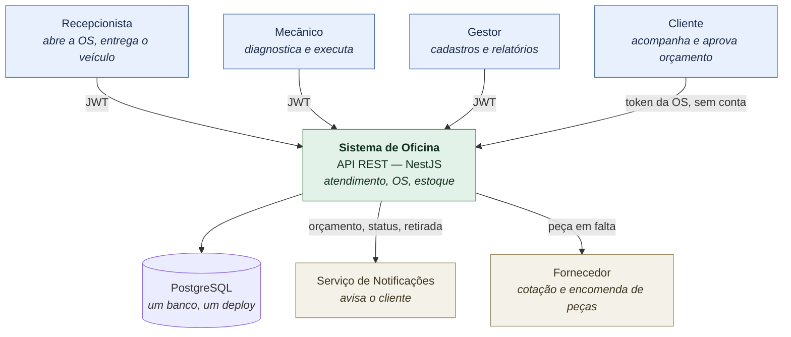
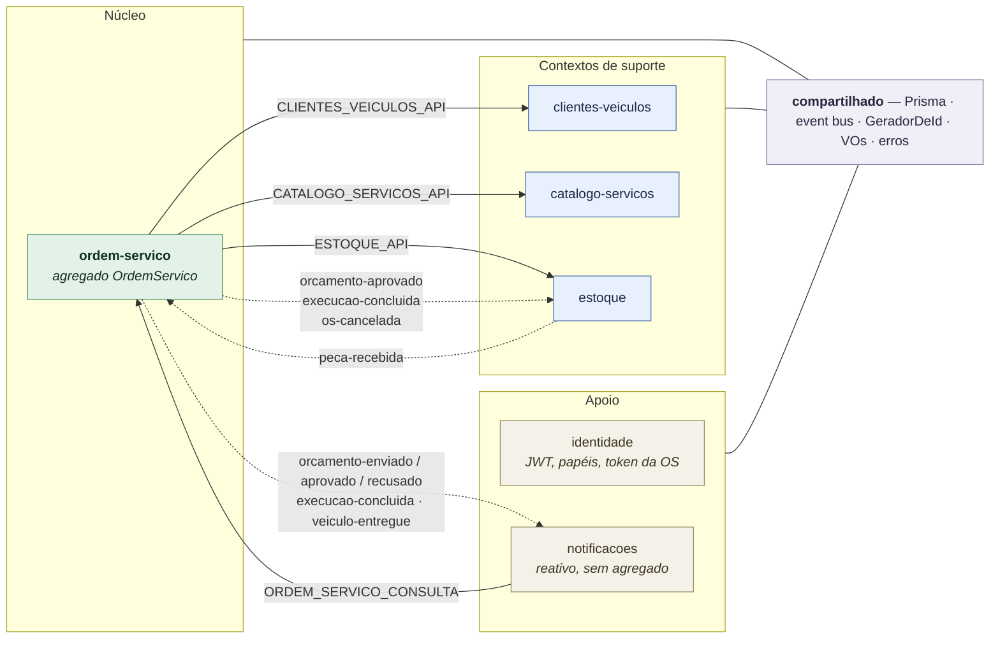
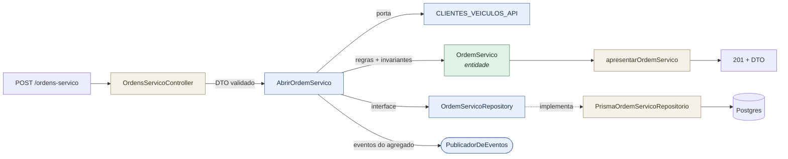
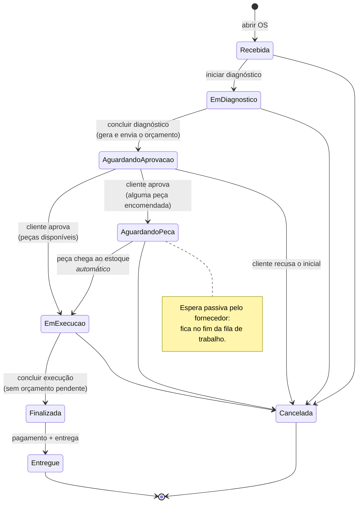
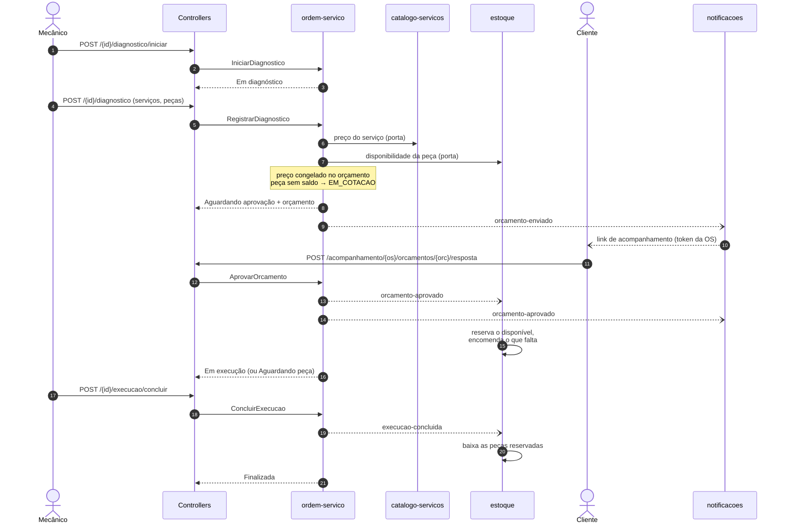
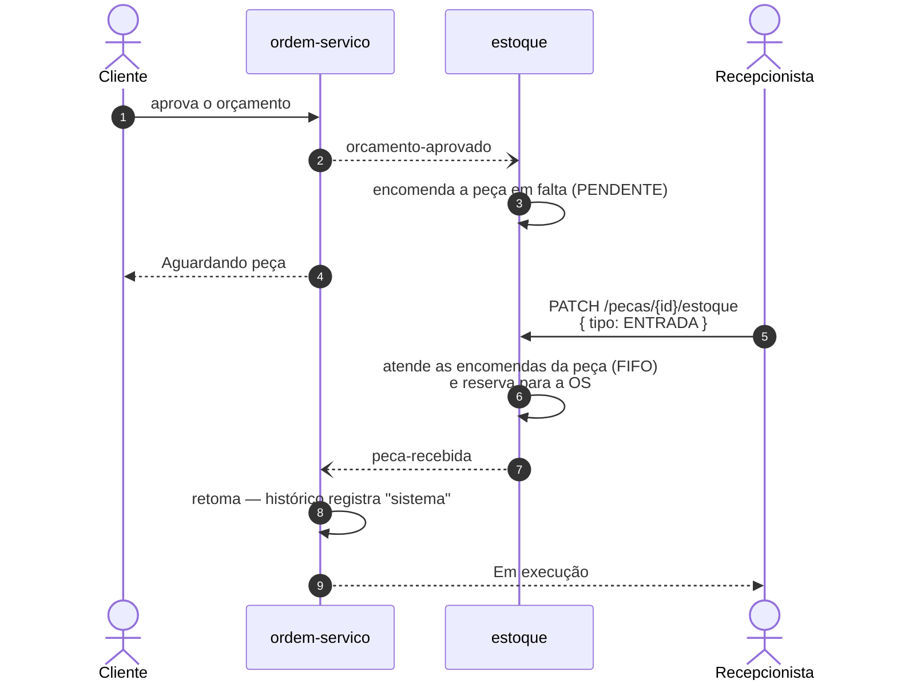

# Arquitetura — visão desenhada

Os diagramas abaixo são a mesma coisa que o código: cada seta existe em algum lugar de `src/`.
Estão em [Mermaid](https://mermaid.js.org) para renderizarem direto no GitHub e para que uma
mudança de arquitetura apareça no diff, como qualquer outro arquivo versionado.

Sumário:

1. [Contexto](#1-contexto-quem-usa-e-com-o-que-conversa)
2. [Módulos e comunicação](#2-módulos-e-comunicação)
3. [Camadas da Clean Architecture](#3-camadas-da-clean-architecture)
4. [Ciclo de vida da OS](#4-ciclo-de-vida-da-os-máquina-de-estados)
5. [Fluxo principal ponta a ponta](#5-fluxo-principal-ponta-a-ponta)
6. [O desvio "peça em falta"](#6-o-desvio-peça-em-falta)

---

## 1. Contexto: quem usa e com o que conversa

Os três papéis administrativos entram pelo mesmo JWT; o que os separa é o papel (`@Papeis('GESTOR')`).
O cliente não tem conta: consulta pelo id da OS e aprova com o **token de acompanhamento**.

---

## 2. Módulos e comunicação

Monolito modular: um deploy e um banco, organizados por **contexto delimitado**. Nenhum módulo
importa entidade ou repositório de outro — só as duas formas de conversa abaixo.

**Linha cheia = porta pública** (interface + token `Symbol`), quando é preciso resposta síncrona:
abrir a OS confere o cliente, e o orçamento busca preço no catálogo e disponibilidade no estoque.

**Linha tracejada = evento** (event bus in-process), quando é efeito posterior. O assinante importa
o contrato do evento com `import type`, sem acoplar em runtime. É o que permite o fan-out: ao
aprovar um orçamento, o núcleo publica **um** evento e o estoque reserva enquanto as notificações
avisam — um sem saber que o outro existe.

| Evento | Publica | Reagem |
|---|---|---|
| `ordem-servico.orcamento-enviado` | ordem-servico | notificacoes |
| `ordem-servico.orcamento-aprovado` | ordem-servico | estoque (reserva/encomenda) · notificacoes |
| `ordem-servico.orcamento-recusado` | ordem-servico | notificacoes |
| `ordem-servico.execucao-concluida` | ordem-servico | estoque (baixa) · notificacoes |
| `ordem-servico.veiculo-entregue` | ordem-servico | notificacoes |
| `ordem-servico.os-cancelada` | ordem-servico | estoque (cancela encomendas) |
| `estoque.peca-recebida` | estoque | ordem-servico (retoma a execução) |

---

## 3. Camadas da Clean Architecture

Cada módulo de domínio abre nas mesmas três pastas. A quarta camada (Frameworks & Drivers) é
global — `main.ts` e `compartilhado/infraestrutura` — e não vira pasta por módulo.

```mermaid
flowchart RL
    subgraph fd["Frameworks & Drivers — global"]
        direction TB
        fd1["main.ts · NestJS · Prisma Client · Postgres · JWT"]
    end

    subgraph ad["adapters/"]
        direction TB
        ad1["controllers/ — REST + Swagger"]
        ad2["presenters/ — entidade → DTO"]
        ad3["gateways/ — implementação Prisma"]
        ad4["dtos.ts — class-validator"]
    end

    subgraph uc["use-cases/"]
        direction TB
        uc1["casos de uso"]
        uc2["interfaces que eles exigem:<br/>repositório · porta pública · gateway"]
    end

    subgraph en["entities/"]
        direction TB
        en1["entidades · value objects · eventos<br/><i>sem Nest, sem Prisma, sem HTTP</i>"]
    end

    fd --> ad --> uc --> en

    classDef c1 fill:#e3f2e8,stroke:#4a8a5f,color:#12301d
    classDef c2 fill:#e8f0fe,stroke:#4a6fa5,color:#1a2b47
    classDef c3 fill:#f4f1e8,stroke:#9a8c68,color:#3d3520
    classDef c4 fill:#f0eef6,stroke:#7a6f9b,color:#2b2440
    class en,en1 c1
    class uc,uc1,uc2 c2
    class ad,ad1,ad2,ad3,ad4 c3
    class fd,fd1 c4
```

As setas são a **regra de dependência**: só apontam para dentro. O gateway Prisma depende da
interface do repositório, que vive junto de quem a exige (o caso de uso) — por isso não existe
pasta `ports/`, que seria vocabulário hexagonal. O porquê de cada decisão está em
[`fase2/decisoes-arquiteturais.md`](fase2/decisoes-arquiteturais.md).

Uma requisição atravessa as camadas assim:

---

## 4. Ciclo de vida da OS (máquina de estados)

Toda mudança passa por `transicionarPara`; o que não está no mapa é rejeitado com
`ErroTransicaoInvalida` → **HTTP 422**.

A **fila de trabalho** (`GET /ordens-servico/fila`) mostra só os estados vivos, nesta prioridade:
Em execução › Aguardando aprovação › Em diagnóstico › Recebida › Aguardando peça — e, dentro de
cada um, as mais antigas primeiro. Finalizada, Entregue e Cancelada saem da fila (exclusão lógica:
continuam no banco).

---

## 5. Fluxo principal ponta a ponta

Do diagnóstico à execução, com o fan-out de eventos na aprovação.

Repare que nenhuma dessas consequências é rota: reservar, encomendar, baixar, gerar orçamento e
notificar acontecem **dentro** da ação que o ator pediu. É o princípio "comando automático não é
rota", do [contrato](contrato-api.md).

---

## 6. O desvio "peça em falta"

Quando o orçamento aprovado tem peça sem saldo, a OS não entra em execução: ela espera. A volta é
automática e nasce de uma entrada de estoque — não de alguém mudando o status na mão.

Se a entrada não cobre a fila inteira, o atendimento para na primeira encomenda que não couber: as
demais seguem PENDENTE até chegar mais peça. E se a OS for cancelada antes disso, o evento
`os-cancelada` cancela as encomendas pendentes dela.

---

## Onde isso vive no código

| Diagrama | Código |
|---|---|
| Portas públicas | `src/*/use-cases/*.api.ts` + `*-api.service.ts` |
| Eventos e assinantes | `src/*/entities/eventos.ts` · `@OnEvent(...)` nas policies/handlers |
| Máquina de estados | `src/ordem-servico/entities/status-os.ts` |
| Agregado e invariantes | `src/ordem-servico/entities/ordem-servico.ts` |
| Persistência do agregado | `src/ordem-servico/adapters/gateways/prisma-ordem-servico.repositorio.ts` |
| Envelope de erro | `src/compartilhado/erros/` |
