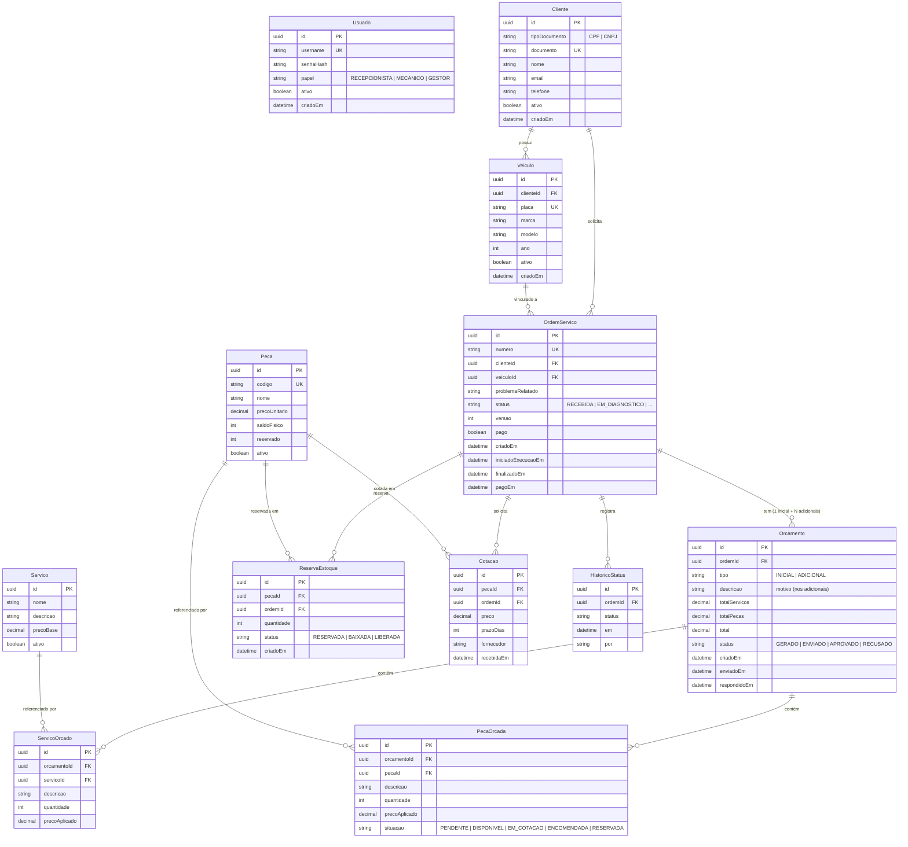
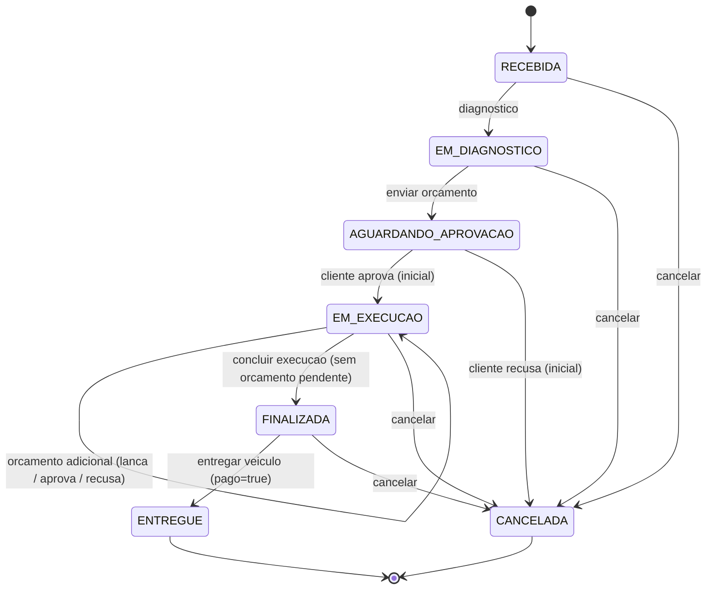

# Roteiro de Testes — Workshop Manager

## Diagrama ER (Mermaid)



> Mudança de modelagem: o antigo `ReparoAdicional` deixou de existir como tabela.
> Um "reparo adicional" agora é um **Orçamento** de `tipo = ADICIONAL` ligado à
> mesma OS. Por isso `Orcamento` é 1‑para‑N com `OrdemServico`, e as linhas
> (`ServicoOrcado`/`PecaOrcada`) pertencem ao **orçamento**, não diretamente à OS.

## Fluxo de Status da Ordem de Servico (Mermaid)



> Aprovar/recusar o orçamento **INICIAL** muda o status da OS. Os orçamentos
> **ADICIONAIS** (lançados durante a execução) não mudam o status — a OS segue em
> `EM_EXECUCAO` e só vai para `FINALIZADA` quando nenhum orçamento estiver
> pendente (`GERADO`/`ENVIADO`).

---

## Cenarios de Teste

### Cenario 1: Autenticacao

| #   | Teste                                            | Metodo | Endpoint     | Resultado Esperado      |
| --- | ------------------------------------------------ | ------ | ------------ | ----------------------- |
| 1.1 | Login com credenciais validas                    | POST   | `/auth/login` | 200 + `accessToken`    |
| 1.2 | Login com senha errada                           | POST   | `/auth/login` | 401                    |
| 1.3 | Login com usuario inexistente                    | POST   | `/auth/login` | 401                    |
| 1.4 | Acessar rota protegida sem token                 | GET    | `/clientes`  | 401                    |
| 1.5 | Acessar rota protegida com token expirado/invalido | GET  | `/clientes`  | 401                    |

**Dados de teste:**
```json
{ "username": "gestor", "senha": "gestor123" }
```

---

### Cenario 2: Cadastro de Clientes

| #    | Teste                           | Metodo | Endpoint         | Resultado Esperado |
| ---- | ------------------------------- | ------ | ---------------- | ------------------ |
| 2.1  | Cadastrar cliente PF (CPF valido) | POST | `/clientes`      | 201                |
| 2.2  | Cadastrar cliente PJ (CNPJ valido) | POST | `/clientes`    | 201                |
| 2.3  | Cadastrar com CPF invalido      | POST   | `/clientes`      | 400                |
| 2.4  | Cadastrar com CPF duplicado     | POST   | `/clientes`      | 409                |
| 2.5  | Cadastrar sem campos obrigatorios | POST | `/clientes`      | 400                |
| 2.6  | Listar todos os clientes        | GET    | `/clientes`      | 200 + array        |
| 2.7  | Buscar cliente por ID           | GET    | `/clientes/{id}` | 200                |
| 2.8  | Buscar cliente inexistente      | GET    | `/clientes/{id}` | 404                |
| 2.9  | Atualizar dados de contato      | PUT    | `/clientes/{id}` | 200                |
| 2.10 | Excluir cliente (soft delete)   | DELETE | `/clientes/{id}` | 204                |

**Exemplo de payload (POST):**
```json
{
  "documento": "529.982.247-25",
  "nome": "Maria Oliveira",
  "email": "maria@email.com",
  "telefone": "11999998888"
}
```

> Obs.: o `tipoDocumento` (CPF/CNPJ) é **derivado** do documento — não envie esse
> campo no payload (o `ValidationPipe` rejeita campos não previstos com 400).

---

### Cenario 3: Cadastro de Veiculos

| #    | Teste                                          | Metodo | Endpoint                          | Resultado Esperado |
| ---- | ---------------------------------------------- | ------ | --------------------------------- | ------------------ |
| 3.1  | Cadastrar veiculo para cliente existente       | POST   | `/clientes/{clienteId}/veiculos`  | 201                |
| 3.2  | Cadastrar com placa formato antigo (ABC-1234)  | POST   | `/clientes/{clienteId}/veiculos`  | 201                |
| 3.3  | Cadastrar com placa Mercosul (ABC1D23)         | POST   | `/clientes/{clienteId}/veiculos`  | 201                |
| 3.4  | Cadastrar com placa duplicada                  | POST   | `/clientes/{clienteId}/veiculos`  | 409                |
| 3.5  | Cadastrar com placa invalida                   | POST   | `/clientes/{clienteId}/veiculos`  | 400                |
| 3.6  | Cadastrar para cliente inexistente             | POST   | `/clientes/{id}/veiculos`         | 404                |
| 3.7  | Listar veiculos de um cliente                  | GET    | `/clientes/{clienteId}/veiculos`  | 200 + array        |
| 3.8  | Buscar veiculo por ID                          | GET    | `/veiculos/{id}`                  | 200                |
| 3.9  | Atualizar veiculo (marca/modelo/ano)           | PUT    | `/veiculos/{id}`                  | 200                |
| 3.10 | Excluir veiculo (soft delete)                  | DELETE | `/veiculos/{id}`                  | 204                |

**Exemplo de payload (POST):**
```json
{
  "placa": "ABC1D23",
  "marca": "Volkswagen",
  "modelo": "Gol",
  "ano": 2020
}
```

---

### Cenario 4: Catalogo de Servicos

| #   | Teste                        | Metodo | Endpoint         | Resultado Esperado |
| --- | ---------------------------- | ------ | ---------------- | ------------------ |
| 4.1 | Cadastrar servico            | POST   | `/servicos`      | 201                |
| 4.2 | Cadastrar sem nome ou preco  | POST   | `/servicos`      | 400                |
| 4.3 | Listar servicos ativos       | GET    | `/servicos`      | 200 + array        |
| 4.4 | Buscar servico por ID        | GET    | `/servicos/{id}` | 200                |
| 4.5 | Atualizar preco base         | PUT    | `/servicos/{id}` | 200                |
| 4.6 | Excluir servico (soft delete)| DELETE | `/servicos/{id}` | 204                |

**Exemplo de payload (POST):**
```json
{
  "nome": "Troca de oleo",
  "descricao": "Troca completa de oleo e filtro",
  "precoBase": 120.00
}
```

---

### Cenario 5: Pecas e Estoque

| #   | Teste                                  | Metodo | Endpoint               | Resultado Esperado                     |
| --- | -------------------------------------- | ------ | ---------------------- | -------------------------------------- |
| 5.1 | Cadastrar peca com estoque inicial     | POST   | `/pecas`               | 201                                    |
| 5.2 | Cadastrar com codigo duplicado         | POST   | `/pecas`               | 409                                    |
| 5.3 | Listar pecas ativas                    | GET    | `/pecas`               | 200 + array                            |
| 5.4 | Buscar peca por ID                     | GET    | `/pecas/{id}`          | 200                                    |
| 5.5 | Atualizar nome/preco                   | PUT    | `/pecas/{id}`          | 200                                    |
| 5.6 | Ajuste manual — entrada de estoque     | PATCH  | `/pecas/{id}/estoque`  | 200 (`saldoFisico` incrementa)         |
| 5.7 | Ajuste manual — saida de estoque       | PATCH  | `/pecas/{id}/estoque`  | 200 (`saldoFisico` decrementa)         |
| 5.8 | Saida maior que saldo disponivel       | PATCH  | `/pecas/{id}/estoque`  | 422                                    |
| 5.9 | Excluir peca (soft delete)             | DELETE | `/pecas/{id}`          | 204                                    |

**Exemplo de payload (POST):**
```json
{
  "codigo": "FILTRO-OLEO",
  "nome": "Filtro de oleo",
  "precoUnitario": 35.00,
  "saldoFisico": 10
}
```

**Exemplo de ajuste de estoque (PATCH):**
```json
{
  "tipo": "ENTRADA",
  "quantidade": 5,
  "motivo": "Recebimento de compra"
}
```

---

### Cenario 6: Fluxo Completo da OS (Happy Path)

**Pre-requisitos:** Cliente, veiculo, servicos e pecas ja cadastrados.

| Passo | Acao                                           | Metodo | Endpoint                                                   | Resultado                                       |
| ----- | ---------------------------------------------- | ------ | ---------------------------------------------------------- | ----------------------------------------------- |
| 6.1   | Abrir OS                                       | POST   | `/ordens-servico`                                          | 201, status = `RECEBIDA`                        |
| 6.2   | Registrar diagnostico (servicos + pecas)       | POST   | `/ordens-servico/{id}/diagnostico`                         | 200, status = `EM_DIAGNOSTICO`, orcamento INICIAL gerado |
| 6.3   | Verificar precos congelados no orcamento       | GET    | `/ordens-servico/{id}`                                     | Precos iguais ao momento do diagnostico         |
| 6.4   | Enviar orcamento ao cliente                    | POST   | `/ordens-servico/{id}/orcamento/enviar`                    | 200, status = `AGUARDANDO_APROVACAO`            |
| 6.5   | Cliente visualiza acompanhamento (publico)     | GET    | `/acompanhamento/{osId}`                                   | 200, orcamentos visiveis (com `id` e `tipo`)    |
| 6.6   | Cliente aprova orcamento inicial               | POST   | `/acompanhamento/{osId}/orcamentos/{orcamentoId}/resposta` | 200, status = `EM_EXECUCAO`                     |
| 6.7   | Verificar reservas de estoque criadas          | GET    | `/ordens-servico/{id}`                                     | Pecas com situacao `RESERVADA`                  |
| 6.8   | Verificar saldo da peca (reservado incrementou)| GET    | `/pecas/{id}`                                              | `reservado` aumentou, `disponivel` diminuiu     |
| 6.9   | Concluir execucao                              | POST   | `/ordens-servico/{id}/execucao/concluir`                   | 200, status = `FINALIZADA`                      |
| 6.10  | Verificar baixa no estoque                     | GET    | `/pecas/{id}`                                              | `saldoFisico` diminuiu, `reservado` voltou      |
| 6.11  | Confirmar pagamento                            | POST   | `/ordens-servico/{id}/pagamento`                           | 200, `pago = true`                              |
| 6.12  | Entregar veiculo                               | POST   | `/ordens-servico/{id}/entrega`                             | 200, status = `ENTREGUE`                        |

> O `orcamentoId` usado em 6.6 vem da resposta do diagnostico (`orcamento.id`) ou
> do acompanhamento (`orcamentos[].id`).

**Exemplo — Abrir OS (POST):**
```json
{
  "clienteId": "<uuid-do-cliente>",
  "veiculoId": "<uuid-do-veiculo>",
  "problemaRelatado": "Barulho na suspensao dianteira ao passar em buracos."
}
```

**Exemplo — Diagnostico (POST):**
```json
{
  "servicos": [
    { "servicoId": "<uuid>", "quantidade": 1 }
  ],
  "pecas": [
    { "pecaId": "<uuid>", "quantidade": 4 }
  ]
}
```

**Exemplo — Aprovar orcamento (POST):**
```json
{ "aprovado": true }
```

**Exemplo — Pagamento (POST):**
```json
{ "pago": true }
```

---

### Cenario 7: Orcamento Recusado pelo Cliente

| Passo | Acao                                           | Metodo | Endpoint                                                   | Resultado                      |
| ----- | ---------------------------------------------- | ------ | ---------------------------------------------------------- | ------------------------------ |
| 7.1   | Abrir OS + diagnostico + enviar orcamento      | —      | —                                                          | Status = `AGUARDANDO_APROVACAO`|
| 7.2   | Cliente recusa orcamento com justificativa     | POST   | `/acompanhamento/{osId}/orcamentos/{orcamentoId}/resposta` | 200, status = `CANCELADA`      |
| 7.3   | Verificar que nenhuma reserva foi criada       | GET    | `/ordens-servico/{id}`                                     | Sem reservas de estoque        |

**Exemplo — Recusar orcamento (POST):**
```json
{
  "aprovado": false,
  "justificativa": "Valor muito alto"
}
```

---

### Cenario 8: Orcamento Adicional Aprovado

> Antes chamado de "reparo adicional". Agora é um novo orçamento (`tipo = ADICIONAL`)
> lançado durante a execução, que nasce já `ENVIADO` aguardando o cliente.

| Passo | Acao                                          | Metodo | Endpoint                                                   | Resultado                               |
| ----- | --------------------------------------------- | ------ | ---------------------------------------------------------- | --------------------------------------- |
| 8.1   | OS em execucao (cenario 6 ate passo 6.6)      | —      | —                                                          | Status = `EM_EXECUCAO`                  |
| 8.2   | Lancar orcamento adicional                    | POST   | `/ordens-servico/{id}/orcamentos-adicionais`               | 201, novo orcamento `ADICIONAL` = `ENVIADO` |
| 8.3   | Verificar que a OS agora tem 2 orcamentos     | GET    | `/ordens-servico/{id}`                                     | `orcamentos` com INICIAL + ADICIONAL; total do inicial inalterado |
| 8.4   | Cliente aprova o orcamento adicional          | POST   | `/acompanhamento/{osId}/orcamentos/{orcamentoId}/resposta` | 200, adicional = `APROVADO`, OS segue `EM_EXECUCAO` |
| 8.5   | Verificar reserva das novas pecas             | GET    | `/pecas/{id}`                                              | `reservado` incrementou                 |
| 8.6   | Concluir execucao                             | POST   | `/ordens-servico/{id}/execucao/concluir`                   | 200, status = `FINALIZADA`              |

**Exemplo — Orcamento adicional (POST):**
```json
{
  "descricao": "Troca da correia dentada (desgaste detectado)",
  "servicos": [
    { "servicoId": "<uuid>", "quantidade": 1 }
  ],
  "pecas": [
    { "pecaId": "<uuid>", "quantidade": 1 }
  ]
}
```

**Exemplo — Aprovar orcamento adicional (POST):**
```json
{ "aprovado": true }
```

---

### Cenario 9: Orcamento Adicional Recusado

| Passo | Acao                                                  | Metodo | Endpoint                                                   | Resultado                   |
| ----- | ----------------------------------------------------- | ------ | ---------------------------------------------------------- | --------------------------- |
| 9.1   | Lancar orcamento adicional (OS em execucao)           | POST   | `/ordens-servico/{id}/orcamentos-adicionais`               | 201, adicional `ENVIADO`    |
| 9.2   | Cliente recusa o orcamento adicional                  | POST   | `/acompanhamento/{osId}/orcamentos/{orcamentoId}/resposta` | 200, adicional = `RECUSADO` |
| 9.3   | Concluir execucao (o trabalho recusado nao e feito)   | POST   | `/ordens-servico/{id}/execucao/concluir`                   | 200, status = `FINALIZADA`  |

---

### Cenario 10: Transicoes de Status Invalidas

| #    | Teste                                                          | Resultado Esperado |
| ---- | -------------------------------------------------------------- | ------------------ |
| 10.1 | Enviar orcamento sem diagnostico (status `RECEBIDA`)           | 422                |
| 10.2 | Concluir execucao sem aprovacao (`AGUARDANDO_APROVACAO`)       | 422                |
| 10.3 | Entregar sem pagamento confirmado                              | 400 (regra de negocio) |
| 10.4 | Entregar com status diferente de `FINALIZADA`                  | 422                |
| 10.5 | Registrar diagnostico em OS ja em execucao                     | 422                |
| 10.6 | Aprovar orcamento de OS cancelada                              | 422                |
| 10.7 | Concluir execucao com orcamento adicional pendente (`ENVIADO`) | 400 (regra de negocio) |

> Distincao util na apresentacao: transicao fora da maquina de estados → **422**;
> violacao de regra de negocio (pagar antes de entregar, concluir com orcamento
> pendente) → **400**.

---

### Cenario 11: Estoque — Peca Indisponivel (Fluxo de Cotacao)

| Passo | Acao                                               | Resultado                                       |
| ----- | -------------------------------------------------- | ------------------------------------------------ |
| 11.1  | Cadastrar peca com `saldoFisico = 0`               | 201                                              |
| 11.2  | Criar OS e fazer diagnostico usando essa peca      | Peca com situacao `EM_COTACAO`                   |
| 11.3  | Verificar que estoque nao foi afetado              | `disponivel` e `reservado` inalterados           |

---

### Cenario 12: Relatorio de Tempo Medio

| #    | Teste                                      | Metodo | Endpoint                                                      | Resultado Esperado             |
| ---- | ------------------------------------------ | ------ | ------------------------------------------------------------- | ------------------------------ |
| 12.1 | Consultar sem filtro de data               | GET    | `/relatorios/tempo-medio-execucao`                            | 200 + tempo medio              |
| 12.2 | Consultar com intervalo de datas           | GET    | `/relatorios/tempo-medio-execucao?inicio=...&fim=...`         | 200 + tempo filtrado           |
| 12.3 | Consultar sem OS finalizadas no periodo    | GET    | `/relatorios/tempo-medio-execucao?inicio=...&fim=...`         | 200 + resultado vazio ou zero  |

---

### Cenario 13: Listagem e Filtros de OS

| #    | Teste                    | Metodo | Endpoint                                    | Resultado Esperado           |
| ---- | ------------------------ | ------ | ------------------------------------------- | ---------------------------- |
| 13.1 | Listar todas as OS       | GET    | `/ordens-servico`                           | 200 + array                  |
| 13.2 | Filtrar por status       | GET    | `/ordens-servico?status=EM_EXECUCAO`        | Apenas OS naquele status     |
| 13.3 | Filtrar por clienteId    | GET    | `/ordens-servico?clienteId=<uuid>`          | Apenas OS do cliente         |

---

### Cenario 14: Cadastro de Usuarios (Restrito ao GESTOR)

| #    | Teste                                              | Metodo | Endpoint     | Resultado Esperado                  |
| ---- | -------------------------------------------------- | ------ | ------------ | ----------------------------------- |
| 14.1 | GESTOR cadastra novo usuario                       | POST   | `/usuarios`  | 201 + `{ id, username, papel, ativo }` |
| 14.2 | Resposta nao expoe a senha/hash                    | POST   | `/usuarios`  | Corpo sem `senha`/`senhaHash`       |
| 14.3 | RECEPCIONISTA/MECANICO tenta cadastrar             | POST   | `/usuarios`  | 403 (papel insuficiente)            |
| 14.4 | Cadastrar sem token                                | POST   | `/usuarios`  | 401                                 |
| 14.5 | Username duplicado                                 | POST   | `/usuarios`  | 409                                 |
| 14.6 | Senha curta (< 6) ou papel invalido                | POST   | `/usuarios`  | 400                                 |

**Exemplo de payload (POST) — com token de GESTOR:**
```json
{
  "username": "recepcao01",
  "senha": "senhaForte123",
  "papel": "RECEPCIONISTA"
}
```

---

## Resumo da Cobertura

| Modulo                      | Cenarios | Testes |
| --------------------------- | -------- | ------ |
| Autenticacao                | 1        | 5      |
| Clientes                    | 2        | 10     |
| Veiculos                    | 3        | 10     |
| Servicos                    | 4        | 6      |
| Pecas/Estoque               | 5, 11    | 12     |
| OS — Happy Path             | 6        | 12     |
| OS — Recusa                 | 7        | 3      |
| OS — Orcamento Adicional    | 8, 9     | 9      |
| OS — Transicoes Invalidas   | 10       | 7      |
| Relatorios                  | 12       | 3      |
| Filtros OS                  | 13       | 3      |
| Usuarios (GESTOR)           | 14       | 6      |
| **Total**                   | **14**   | **~86**|
